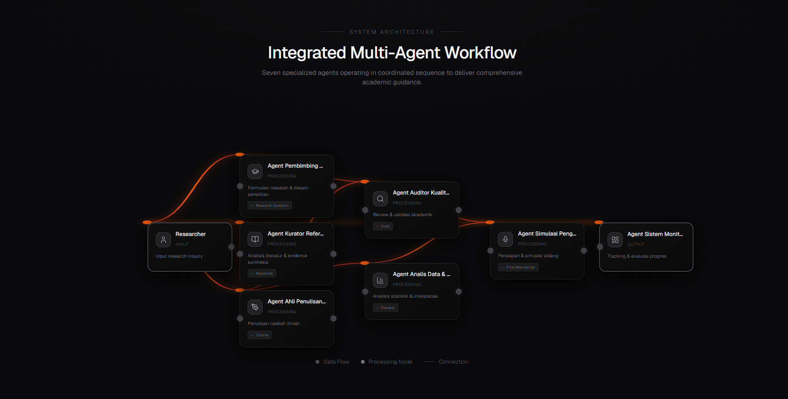

<div align="center">

# Sentra Academic Solutions (SAS)



### Tech Stack


[](LICENSE)/>

## Overview

**Sentra Academic Solutions (SAS)** is Indonesia's pioneering multi-agent AI platform, purpose-built for Health Sciences academia. Unlike generic AI tools that merely respond to queries, SAS orchestrates **7 specialized intelligent agents** to comprehensively guide students, lecturers, researchers, and healthcare professionals through the **complete academic writing lifecycle**—from research question formulation to confident thesis defense preparation.

Developed by **Sentra Healthcare Artificial Intelligence** in strategic partnership with **Institut Ilmu Kesehatan (IIK)**, SAS is deeply anchored in Indonesian academic standards, local institutional requirements, and the practical challenges encountered daily by Health Sciences students.

**ChatGPT writes. Paperpal edits. Jenni AI drafts. SAS delivers the full journey to graduation.**[^6][^1]

## Core Differentiators

SAS stands unparalleled by addressing the **entire academic pipeline** in a specialized, contextual manner:


| Feature | ChatGPT | Paperpal | Jenni AI | Paperguide | **SAS** |
| :-- | :-- | :-- | :-- | :-- | :-- |
| Multi-Agent Orchestration | ✗ | ✗ | ✗ | ✗ | ✓ |
| Health Sciences Specialization | ✗ | ✗ | ✗ | ✗ | ✓ |
| Statistical Test Advisor | ✗ | ✗ | ✗ | ✗ | ✓ |
| Thesis Defense Simulator | ✗ | ✗ | ✗ | ✗ | ✓ |
| Supervisor Multi-Student Dashboard | ✗ | ✗ | ✗ | ✗ | ✓ |
| Indonesian Academic Compliance | ✗ | Partial | ✗ | ✗ | ✓ |
| Institutional Template Alignment | ✗ | ✗ | ✗ | ✗ | ✓ |
| Powered by Claude (Anthropic) | ✗ | ✗ | ✗ | ✗ | ✓ |

## The 7 Specialized Agents

SAS employs a sophisticated agent router to dispatch queries to domain-expert agents:


| Agent | Primary Role | Best Use Cases |
| :-- | :-- | :-- |
| **Academic Supervisor** | Research design, topic formulation, methodology selection, proposal structuring | Quantitative/qualitative design selection, proposal Bab 1-3 |
| **Writing Assistant** | Chapter-by-chapter academic writing guidance | Drafting Bab 1-5 with Indonesian thesis precision |
| **Quality Analyst** | Coherence, citation completeness, academic standards compliance review | Pre-submission audits, plagiarism risk assessment |
| **Statistical Analysis** | Test selection, execution guidance, result interpretation | ANOVA, Chi-Square, Spearman, regression matching |
| **Literature \& Reference** | Literature matrix construction, reference management, gap analysis | Systematic reviews, state-of-the-art synthesis |
| **Defense Simulator** | Examiner question simulation, response strategy training | Mock defenses with 50+ question banks |
| **Supervisor Dashboard** | Multi-student progress tracking, risk prioritization | Managing 5-50 students, automated progress reports |

## Target Users

- **Undergraduate \& Postgraduate Students**: Nursing, Medicine, Public Health, Pharmacy, Nutrition, and allied Health Sciences pursuing theses/dissertations.
- **Lecturers \& Supervisors**: Faculty overseeing multiple theses, requiring structured progress monitoring and intervention prioritization.
- **Healthcare Researchers**: Conducting empirical studies, systematic reviews, or journal publications needing AI-augmented literature synthesis.
- **Clinical Professionals**: Practitioners authoring first scientific papers or advanced credentials amid demanding clinical schedules.[^4]


## Quick Start Guide

### Prerequisites

- Active **Claude.ai** account (Pro or Team plan strongly recommended for unlimited usage).
- Access to **Claude.ai Projects** feature.


### 4-Step Implementation (Under 10 Minutes)

1. **Create Dedicated Project**
Navigate to [claude.ai](https://claude.ai) → **Projects** → **Create Project** → Name: `"Sentra Academic Solutions (SAS)"`.
2. **Configure Custom Instructions**
Project Settings → **Custom Instructions** → Paste the **full contents** of `sentra-academic-solutions-project-instructions.md` (included in this repo).
3. **Upload Comprehensive Knowledge Base** (Essential for Accuracy)


| Category | Recommended Documents |
| :-- | :-- |
| **Writing Guidelines** | Institutional thesis manual, chapter templates (Bab 1-5), citation styles (Vancouver/APA) |
| **Institutional Templates** | Cover pages, approval sheets, originality declarations, formatting rubrics |
| **Methodology Guides** | Research SOPs, ethical clearance forms, questionnaire validation protocols |
| **Regulations** | Rector's decrees, Kemendikbud academic standards, plagiarism policies |
| **Exemplary Theses** | 2-3 high-scoring sample theses (A-grade) as quality benchmarks |
| **Assessment Rubrics** | Defense evaluation sheets, manuscript eligibility checklists |
| **Statistical Resources** | Test selection flowcharts, SPSS/Stata interpretation guides, power analysis tables |

4. **Initiate Interaction**

```
Hi SAS, I'm a 7th-semester Nursing student researching the correlation between sleep quality and academic performance among clinical-year students. Where should I begin?
```


## Advanced Usage Examples

### Academic Supervisor Agent

```
User: "I'm uncertain about research design for studying the impact of nutrition education on anemia knowledge among pregnant women in rural Puskesmas. What design do you recommend, including sample size justification?"
```


### Writing Assistant Agent

```
User: "Outline Chapter 2 (Literature Review) for my study on hypertension risk factors among elderly patients at primary health centers, incorporating 2024-2026 Indonesian cohort studies."
```


### Quality Analyst Agent

```
User: "Review the following Chapter 1 draft for coherence, citation completeness, logical flow, and compliance with IIK thesis standards: [paste 2000-word draft here]"
```


### Statistical Analysis Assistant

```
User: Independent variable: stress level (ordinal, 3 categories). Dependent: systolic BP (continuous). n=85. Potential confounders: age, BMI. Recommend test with effect size/power calculation?
```


### Literature \& Reference Assistant

```
User: "Construct a literature matrix from these 12 articles on obesity-Type 2 diabetes links (2019-2026), highlighting Indonesian studies and methodological gaps: [DOI list]"
```


### Defense Simulator Agent

```
User: Thesis title: "Dietary Patterns and Gastritis Incidence Among University Students in West Java." Simulate 15 examiner questions categorized by chapter, with model responses.
```


### Supervisor Dashboard Agent

```
User: "Supervising 12 students. Progress: Student A (Bab 3 complete), Student B (stuck Bab 2), etc. Generate risk-prioritized summary table and intervention recommendations."
```


## Development Roadmap

```
2026 Q1-Q2 (MVP Complete)    2026 Q3-Q4         2027+
├── Phase 1: Core Agents     ├── Phase 2         ├── Phase 4: Production
│   ✅ Supervisor            │   ✅ Stats         │   🔮 REST API
│   ✅ Writing               │   ✅ Literature    │   🔮 WhatsApp Bot
│   ✅ Quality               │                   │   🔮 Web/Mobile Apps
├── Phase 3: Advanced        │
│   📅 Defense Simulator     │
│   📅 Dashboard             │
```

**Current Status (March 2026)**: MVP operational with Phases 1-2 live. Phase 3 deploying Q2 2026.[^6]

## System Architecture

```
┌─────────────────────┐    ┌─────────────────────────────┐
│   User Interfaces   │    │     Agent Router (SAS)      │
│  • Student Chat     │◄──►│  • Query Classification     │
│  • Supervisor Dash  │    │  • Context-Aware Dispatch   │
│  • Researcher Portal│    │  • Multi-Agent Coordination │
└──────────┬──────────┘    └────────────┬────────────────┘
           │                             │
           ▼                             ▼
┌─────────────────────┐    ┌──────────────────────────────────────┐
│   7 Specialized     │    │   Claude AI Core + Knowledge Base    │
│      Agents         │◄──►│ • Institutional Guidelines          │
│ • Supervisor Agent  │    │ • Sample Theses (n=50+)             │
│ • Writing Agent     │    │ • Statistical Tables & Flowcharts   │
│ • Quality Agent     │    │ • 2024-2026 Health Lit (10k+ refs)  │
│ • Stats Agent       │    └──────────────────────────────────────┘
│ • Lit Agent         │
│ • Defense Agent     │
│ • Dashboard Agent   │
└─────────────────────┘
```

Powered exclusively by **Anthropic Claude** for superior reasoning and safety.[^7]

## Development Team

| Role | Contributor / Entity |
| :-- | :-- |
| **Lead Developer** | Sentra Healthcare Artificial Intelligence |
| **Academic Partner** | Institut Ilmu Kesehatan (IIK), Indonesia |
| **AI Infrastructure** | Anthropic (Claude AI) |
| **Project Director** | Claudesy, CEO Sentra AI |

## License \& Academic Ethics Statement

**Proprietary Software** developed by Sentra Healthcare Artificial Intelligence in partnership with IIK.

**Mandatory Ethical Guidelines**:

- ✅ **Use as Assistant Only**: SAS amplifies human intelligence—never replaces original research, critical analysis, or intellectual contribution.
- ✅ **Mandatory Disclosure**: Declare AI assistance in all submissions per institutional policy (e.g., IIK plagiarism guidelines).
- ✅ **Human Oversight Required**: Review and edit all AI outputs before submission.
- ❌ **Prohibited**: Direct submission of unedited AI content; bypassing ethics boards; academic dishonesty.

**SAS upholds the highest academic integrity standards**, aligned with Kemendikbud Ristek regulations. Violations may result in platform access revocation.[^3]

## Contributing

1. Fork the repository.
2. Create feature branch (`git checkout -b feature/AmazingFeature`).
3. Commit changes (`git commit -m 'Add some AmazingFeature'`).
4. Push to branch (`git push origin feature/AmazingFeature`).
5. Open Pull Request.[^8]

## Partnerships \& Deployment

**Institutional Deployment Available**: Customized SAS instances for Health Sciences faculties across Indonesia.

- **Organization**: Sentra Healthcare Artificial Intelligence (Cibinong, West Java).
- **Partnership Inquiries**: Indonesian Health Sciences institutions—contact for white-label licensing.
- **Academic Licensing**: Via official IIK channels.

## Citation
If using SAS in publications:
`Sentra Academic Solutions (SAS): Multi-Agent AI Platform for Indonesian Health Sciences Academia. Sentra Healthcare AI & IIK, 2026.`

***
